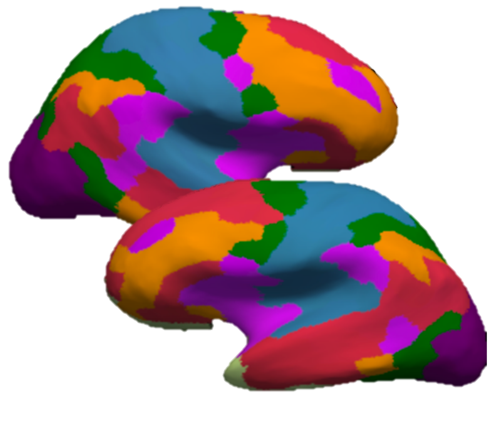
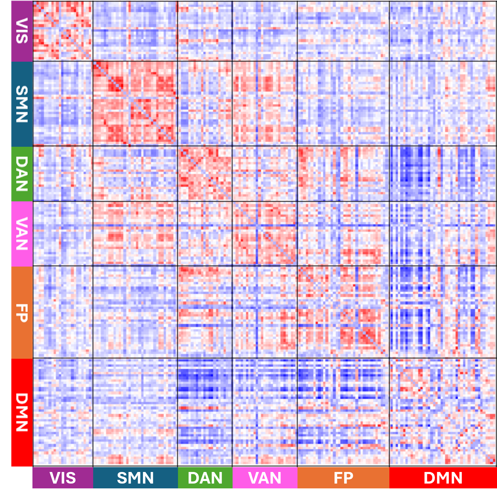
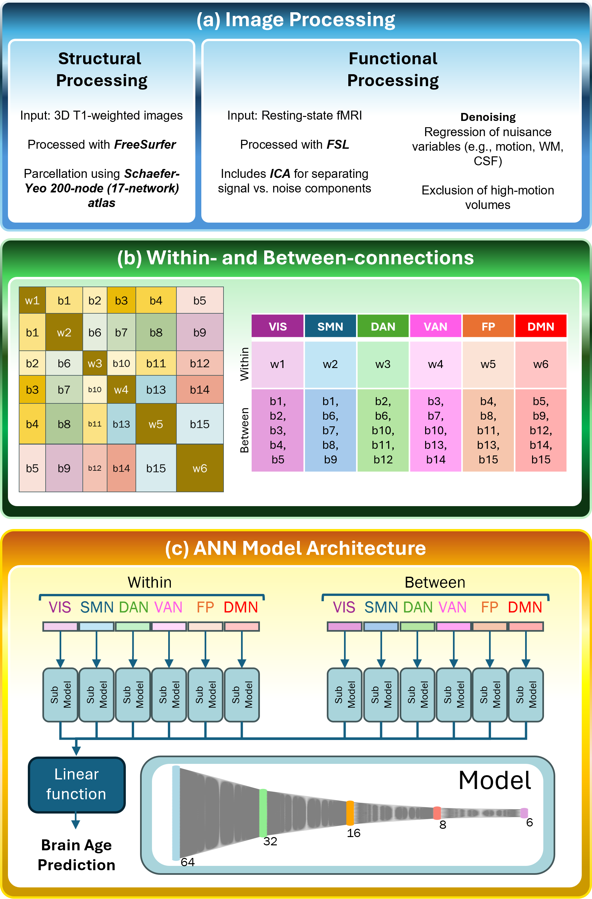

Structured Artificial Neural Networks for Chronological Brain Age Prediction (SIPAIM 2025)
==========================================================================================
Repository for: "Structured Artificial Neural Networks for Chronological Brain Age Prediction using Functional Connectivity Matrices"
Presented at: SIPAIM 2025 — Pasto, Colombia (19–21 Nov 2025)

INTRODUCTION
------------
This work proposes a biologically informed artificial neural network that separates within-network and between-network functional connectivity (FC) information to predict chronological brain age from resting-state fMRI FC matrices. FC matrices were derived using a parcellation and organized by functional networks; the model processes within- and between-network connectivity through dedicated submodels whose outputs are concatenated for age regression. Model interpretability is provided using Grad-CAM-like methods to highlight important connections.

<table>
  <tr>
    <td align="center">
       
      Parcellation / atlas (fig_atlas.png)
    </td>
    <td align="center">
       
      Representative FC matrix (fig_fc_matrix.png)
    </td>
  </tr>
</table>

METHOD (brief)
--------------
The structured ANN explicitly extracts within-network and between-network blocks from each FC matrix and feeds them into paired submodels (separate processing streams for within- and between-network connectivity). Each submodel is composed of stacked fully connected layers; the outputs from all submodels are concatenated and passed to a final regression head that predicts chronological age. Training used age-stratified cross-validation and interpretability analyses (Grad-CAM-like) to identify which connections drive the predictions.

REPOSITORY CONTENTS & EXPLANATION
---------------------------------
- eval_fmri_model.py
  A Python script for running model predictions:
  - Loads a saved Keras model (`model_new.h5`).
  - Preprocesses input FC matrix/matrices (expected format: numpy .npy or similar; check script).
  - Runs inference and optionally computes interpretability maps (Grad-CAM-like).
  - Produces predicted ages and can save outputs to CSV/NPY.
  Example (replace args with your script's flags):
    python eval_fmri_model.py --model model_new.h5 --input path/to/fc_matrix.npy --output predictions.csv

- eval_fmri_model.sh
  Example Slurm wrapper showing how to call `eval_fmri_model.py` with `sbatch`.
  Use this as a template — update modules / conda env / paths / resources to match your cluster.

- run_fmri_train.py
  Builds the structured ANN and performs training:
  - Builds the within-/between-network submodels and concatenates them.
  - Handles training loop, checkpointing, and (optionally) cross-validation splits and logging.
  - Hyperparameters used in the paper are set inside the script (optimizer, loss, epochs, batch size).
  Run locally or on cluster (recommended via Slurm wrapper below).

- run_fmri_train.sh
  Slurm wrapper to launch `run_fmri_train.py` on HPC (example `sbatch run_fmri_train.sh`).
  Update requested resources (GPUs, memory, time) to match your environment.

- model_new.h5
  Pretrained Keras model in HDF5 format. Provided for inference without retraining.
  Load example:
    import tensorflow as tf
    model = tf.keras.models.load_model("model_new.h5")

-
REQUIREMENTS & RECOMMENDED ENVIRONMENT
-------------------------------------
(These are suggested; pin exact versions in a requirements.txt for reproducibility.)
- Python 3.6+ (3.6 recommended)
- TensorFlow / Keras
- NumPy, pandas, scikit-learn
- matplotlib (for plotting)
- Any additional libraries used in scripts (argparse, joblib, etc.)
- For GPU training: CUDA + cuDNN + appropriate drivers; Slurm for HPC job scheduling

QUICK START (EXAMPLES)
----------------------
1) Create environment and install dependencies (example using conda):
   conda create -n brainage python=3.9 -y
   conda activate brainage
   install all packages
   
3) Evaluate using the pretrained model (local example):
   python eval_fmri_model.py 

   Or submit the Slurm wrapper:
   sbatch eval_fmri_model.sh

4) Train from scratch (via Slurm wrapper):
   sbatch run_fmri_train.sh
   (Adjust GPU / memory / time in `run_fmri_train.sh` to match your cluster.)

USAGE NOTES
-----------
- Ensure the FC input format expected by the scripts matches your files (N patients, 186 * 186 flattened matrix).
- If you change TensorFlow versions, re-check that loading `model_new.h5` is compatible (sometimes HDF5 model files require matching TF/Keras versions).
- If you want to retrain and save a new model, update `run_fmri_train.py` to write checkpoints and final model with a clear naming pattern (e.g., model_epoch{epoch:02d}.h5).

CITATION
--------
If you use this code or model, please cite:
"Structured Artificial Neural Networks for Chronological Brain Age Prediction using Functional Connectivity Matrices" — SIPAIM 2025.

CONTACT
-------
For questions about the paper or code, e-mail me at kaue.duarte@ucalgary.ca

